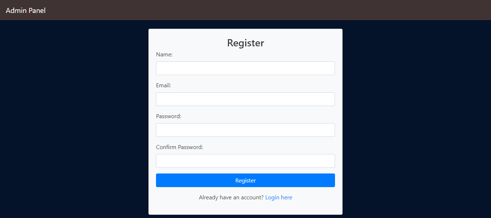
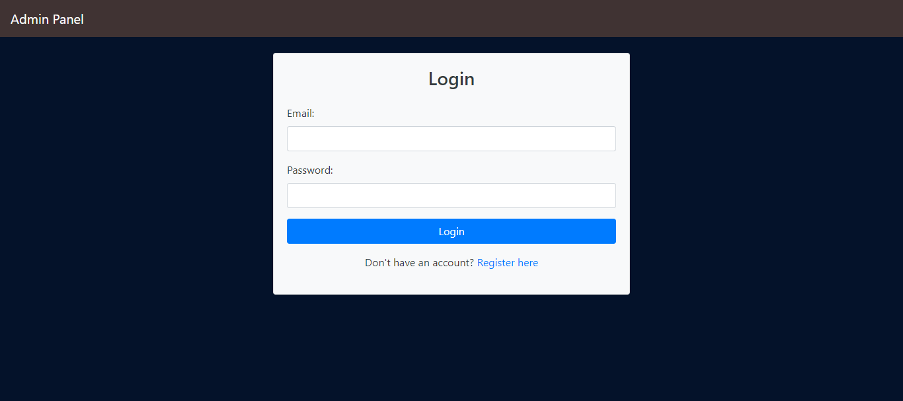
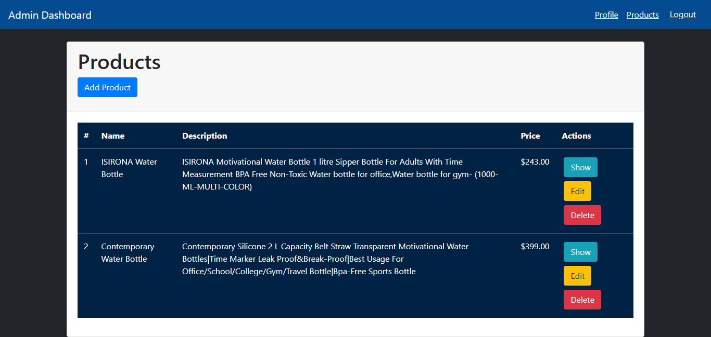
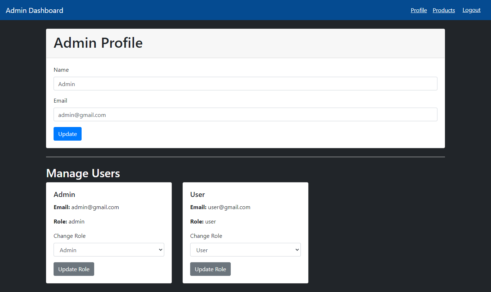
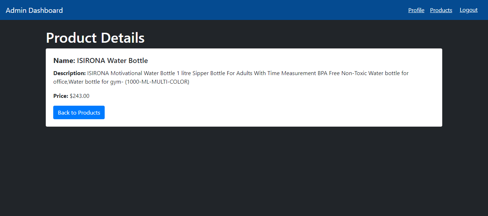
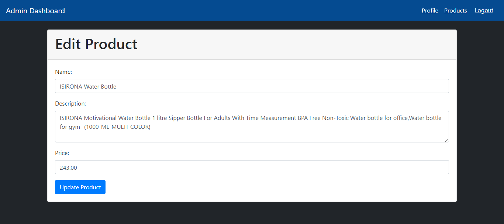
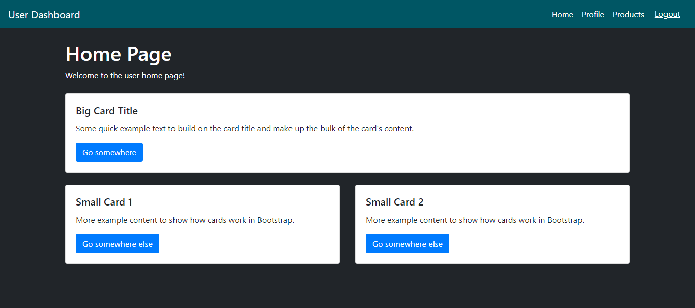

This repository contains a Laravel project for an Admin and User management system, including product management functionality.

# all the data regarding SQL file and Postman collection is present inside data folder









## Installation

Follow these steps to set up the project locally:

1. **Clone the repository:**

   ```bash
   git clone https://github.com/Pandey-Narendra/admin_panel.git
   cd admin_panel

2. Install Composer dependencies:

    ```bash
    composer install

3. Update the .env file with your database credentials and other necessary configurations.

4. Run database migrations:

    ```bash
    php artisan migrate

5. Run Seeder Class
    ```bash
    php artisan db:seed --class=UserSeeder

6. Serve the application:

    ```bash
    php artisan serve

## Login Credentials

1.  User Account:
    Email: user@gmail.com
    Password: user@1234

2.  Admin Account:
    Email: admin@gmail.com
    Password: admin@1234


### Without APIs

## User Panel

1. User Profile: 
    /user/profile - Get and update user profile

2. Home Page:
    /user/home - View user home page

3. Products:
    /user/products - View products

## Admin Panel

1. Admin Profile:
    /admin/profile - Get and update admin profile

2. Products Management:
    /admin/products - List, create, update, delete products with pagination

###  With APIs

## for API Endpoints

### Authentication

- `POST /api/register` - Register a new user
- `POST /api/login` - Login a user
- `POST /api/logout` - Logout a user (authenticated)

### User

- `GET /api/user/profile` - Get user profile (authenticated, user only)
- `GET /api/user/home` - Get user home page data (authenticated, user only)
- `GET /api/user/products` - Get product listing (authenticated, user only)

### Admin

- `GET /api/admin/profile` - Get admin profile (authenticated, admin only)
- `PUT /api/admin/profile` - Update admin profile (authenticated, admin only)
- `GET /api/admin/products` - List products with pagination (authenticated, admin only)
- `POST /api/admin/products` - Create a new product (authenticated, admin only)
- `GET /api/admin/products/{id}` - Get product details (authenticated, admin only)
- `PUT /api/admin/products/{id}` - Update product details (authenticated, admin only)
- `DELETE /api/admin/products/{id}` - Delete a product (authenticated, admin only)

### Role Management 

- `GET /api/admin/users` - Get all the users (authenticated, admin only)
- `PUT /api/admin/users/{id}/role` - Update users role (authenticated, admin only)

### Testing APIs using Postman

1. Register a new user:

    URL: POST http://127.0.0.1:8000/api/register
    
    ```bash
    Body: 
        {
        "name": "Test User",
        "email": "testuser@gmail.com",
        "password": "password",
        "password_confirmation": "password"
        }

2. Login:

    URL: POST http://127.0.0.1:8000/api/login

    ```bash
    Body:
        {
            "email": "testuser@gmail.com",
            "password": "password"
        }

   Note: Copy the token from the response for authenticated requests.

3. Get user profile:

    URL: GET http://127.0.0.1:8000/api/user/profile

    ```bash
    Headers:
        Authorization: Bearer <token>


4. Logout:

    URL: POST http://127.0.0.1:8000/api/logout

    ```bash
    Headers:
        Authorization: Bearer <token>


5. Get admin profile (admin only):

    URL: GET http://127.0.0.1:8000/api/admin/profile

    ```bash
    Headers:
        Authorization: Bearer <token>

6. Update admin profile (admin only):

    URL: PUT http://127.0.0.1:8000/api/admin/profile

    ```bash
    Headers:
        Authorization: Bearer <token>

    ```bash
    Body:
        {
            "name": "Updated Admin",
            "email": "admin_updated@gmail.com"
        }

7. List products (admin only):

    URL: GET http://127.0.0.1:8000/api/admin/products

    ```bash
    Headers:
        Authorization: Bearer <token>

8. Create a new product (admin only):

    URL: POST http://127.0.0.1:8000/api/admin/products

    ```bash
    Headers:
        Authorization: Bearer <token>

    ```bash
    Body:
        {
            "name": "New Product",
            "description": "Product description",
            "price": 100
        }

9. Get product details (admin only):

    URL: GET http://127.0.0.1:8000/api/admin/products/{id}

    ```bash
    Headers:
        Authorization: Bearer <token>

10. Update product details (admin only):

    URL: PUT http://127.0.0.1:8000/api/admin/products/{id}

    ```bash
    Headers:
        Authorization: Bearer <token>

    ```bash
    Body:
        {
            "name": "Updated Product",
            "description": "Updated description",
            "price": 150
        }

11. Delete a product (admin only):

    URL: DELETE http://127.0.0.1:8000/api/admin/products/{id}

    ```bash
    Headers:
        Authorization: Bearer <token>

12. Get all the users (authenticated, admin only)

    URL: GET http://127.0.0.1:8000/api/admin/users

    ```bash
    Headers:
        Authorization: Bearer <token>

13. Update users role (authenticated, admin only)

    URL: PUT http://127.0.0.1:8000/api/admin/users/{id}/role

    ```bash
    Headers:
        Authorization: Bearer <token>
    Body:
        {
            "name": "admin"
        }
